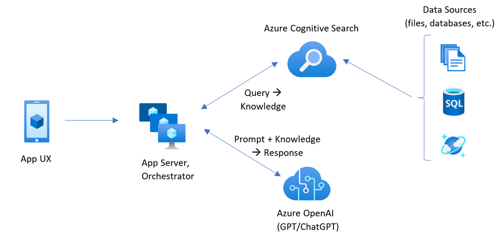

# openai_steam
A collection of science, technology, engineering, AI and mathematical (STEAM) tools to accelerate openai based development and deployment

### Installation and Deployment
1. Create a new folder
and clone this repository to get the code base

<!-- ## Following changes may be needed to make it run successfully 
\infra\core\ai\cognitiveservices.bicep
change line 10 from  name: 'S0' to name: 'C2' -->

2. Run `azd auth login`

3. Run `azd init --template [GitHub repo URL]`
    * For the target location, the regions that currently support the models used are **East US** or **South Central US**. For an up-to-date list of regions and models, check [here](https://learn.microsoft.com/en-us/azure/cognitive-services/openai/concepts/models)

4. Run `azd up` to provision Azure resources and deploy the chat assitant service those resources. This will also build the search index based on the knowledge base files located in the `./data` folder. To use your own files, replace the pdfs in this folder with your data.

5. Once the application is successfully deployed, a URL will be printed to the console.  You can use that URL to interact with the application in your browser.  

6. To redeploy after changes, run `azd up`

This repo uses READ->RETRIEVE->READ, READ->DECOMPOSE->ASK, RETRIEVE->THEN->READ approaches over user provided data using the Retrieval Augmented Generation pattern. It uses Azure OpenAI Service to access the ChatGPT model (gpt-35-turbo), and Azure Cognitive Search for data indexing and retrieval.

The repo includes sample publication data.

